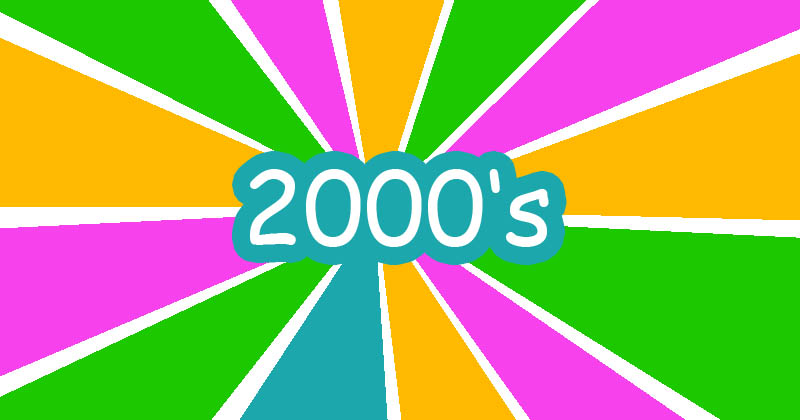

```{r setup, include=FALSE}
knitr::opts_chunk$set(echo = TRUE)
```


```{r, message=FALSE, warning=FALSE}
packages.used=c("dplyr","textdata","ggplot2","gridExtra","tidytext","wordcloud2","knitr","kableExtra","formattable","stringr","tm","igraph","tidyverse","ggraph","rsconnect","DT","wordcloud","scales","cowplot","reshape2","data.table","lexicon","ggthemes","syuzhet","sentimentr","tibble","qdap")

# 1. check required packages
packages.needed=setdiff(packages.used, 
                        intersect(installed.packages()[,1], 
                                  packages.used))
# 2.install lacked packages
if(length(packages.needed)>0){
  install.packages(packages.needed, dependencies = TRUE)
}

# 3.load all packages
library(dplyr) #data manipulation
library(textdata)
library(ggplot2) #visualizations
library(gridExtra) #viewing multiple plots together
library(tidytext) #text mining
library(wordcloud2) #creative visualizations
library(knitr) # for dynamic reporting
library(kableExtra) # create a nicely formated HTML table
library(formattable) # for the color_tile function
library(stringr)
library(tm)
library(igraph)
library(tidyverse)
library(ggraph)
library(rsconnect)
library(DT)
library(wordcloud)
library(scales)
library(cowplot)
library(reshape2)
library(data.table)
library(lexicon)
library(ggthemes)
library(syuzhet)
library(sentimentr)
library(tibble)
library(qdap)
```

## Introduction

The purpose of this project is to analyze the trend of music lyrics in the lyrics data collected from 1970 to 2016. The entire dataset-"lyrics.csv" is a filtered corpus of lyrics from more than 380,000 songs from MetroLyrics. You can read more about it on [Kaggle] (https://www.kaggle.com/gyani95/380000-lyrics-from-metrolyrics). For the purpose of this report, I have mined the lyrics data from two aspects, namely the number of songs and the lyrics information. I mainly performed deep mining of song lyrics features in the 2000s where the number of songs surged.

## Step0: Combining processed data with artist data

The Given code in Text_Processing.Rmd cleans up the original data by removing stop words and performing various preprocessing tasks (such as converting all lyrics to lower case, removing punctuation, numbers, empty words, extra spaces, and stems) set. The cleaned-up version of the data is then saved as an RData file.

```{r, message=FALSE, warning=FALSE}
#loading processed lyrics data
load('../output/processed_lyrics.RData')
artists = read_csv('../data/artists.csv')
names(artists) = c("artist", "intro", "formed", "members", "origin")
All_data = dt_lyrics %>%
  left_join(artists, by = "artist")
```


## Step1: Basic EDA

Firstly we can look at the overall data structure and form after adding artist information.We can see that each type of data of the processed and combined data is stored in different columns, and the lyrics information does not contain any stop words or inappropriate words.

```{r,warning=FALSE, message=FALSE}
#structure of the lyrics
str(All_data[1, ])
```

Second, we can look at the number of new songs released each year from 1970 to 2016. It can be noted thatThere was a sudden spike in the number of songs in 2005, and the number of songs released after this year has far exceeded the level of previous years.

```{r,warning=FALSE, message=FALSE}
song_number<-table(All_data$year)
plot(song_number,xlim=c(1970,2016),type="line")
```


## Step2： Divide each decade into an era and analyze the types of songs in each era

Through EDA, we can see that the 2000s is an unusual age, so what are the characteristics of this era? What kind of wave led to the explosion of such songs? We conduct further research.

```{r,warning=FALSE, message=FALSE}
#Creating buckets for decades
All_data <- All_data %>%
  mutate(decades = 
           ifelse(year %in% 1970:1979, "1970s",
           ifelse(year %in% 1980:1989, "1980s", 
           ifelse(year %in% 1990:1999, "1990s", 
           ifelse(year %in% 2000:2009, "2000s", 
           ifelse(year %in% 2010:2020, "2010s", 
                  "NA"))))))
```


We can further observe the distribution of song genres every ten years.One of the goals is to look for song trends across time, and the dataset contains various release years-we can create buckets and group these years into decades. The chart below shows the number of songs released per decade from the 1960s to the 2010s.

```{r,warning=FALSE, message=FALSE}
library(magrittr)
All_data %>%
  filter(decades != "NA",  genre != "Not Available") %>%
  dplyr::group_by(decades, genre) %>%
  dplyr::summarise(song_num  = n()) %>%
  ggplot() + 
  geom_bar(aes(x = decades, y = song_num, 
               fill = genre), stat = "identity")  +
  theme(plot.title = element_text(hjust = 0.5),
        legend.title = element_blank(),
        panel.grid.minor = element_blank()) +
  ggtitle("Different genre of Songs number by decades") +
  labs(x = NULL, y = "Songs number")

```

According to the figure above, we can see that there was an explosion of the total number of songs in the 2000s. So how were the specific song types distributed in this era?Through the pie chart, we can see that this golden age is mainly caused by the surge in the number of rock music, pop music and metal music.

```{r}
All_data %>%
  filter(decades == "2000s",  genre != "Not Available") %>%
  dplyr::group_by(decades, genre) %>%
  dplyr::summarise(song_num  = n()) %>%
  ggplot() + 
  geom_bar(aes(x = decades, y = song_num, 
               fill = genre), stat = "identity")  +
  theme(plot.title = element_text(hjust = 0.5),
        legend.title = element_blank(),
        panel.grid.minor = element_blank()) +
  ggtitle("Genre distribution of Songs number in 2000s") +
  labs(x = NULL, y = "Songs number")+
  coord_polar("y", start=0)
```


## Step3: What were the most popular lyrics in the 2000s? Let's see the word cloud!

The figure shows the top 10 most popular words in the lyrics dataset. 

```{r,warning=FALSE, message=FALSE}
song_words_filtered = All_data %>%
  unnest_tokens(word, stemmedwords) %>%
  anti_join(stop_words) %>%
  distinct() %>%
  filter(nchar(word) > 3)

song_words_filtered %>%
   filter(decades == "2000s") %>%
  dplyr::count(word, sort = TRUE) %>%
  top_n(10) %>%
  ungroup() %>%
  mutate(word = reorder(word, n)) %>%
  ggplot() +
    geom_col(aes(word, n), fill = "blue") +
    theme(legend.position = "none", 
          plot.title = element_text(hjust = 0.5),
          panel.grid.major = element_blank()) +
    xlab("") + 
    ylab("Song Count") +
    ggtitle("Most popular lyrics in 2000s") +
    coord_flip()
```


**Word Cloud 1: Most popular lyrics in 2000s**
 
We can see that in such a golden period of soaring song numbers, the core theme of all songs is still love.
```{r,warning=FALSE, message=FALSE}
word_counts_2000s <- song_words_filtered %>%
   filter(decades == "2000s") %>%
  dplyr::count(word, sort = TRUE)

set.seed(2875)
wordcloud2(word_counts_2000s[1:300, ], size = .5)
```


## Step4: What were the most popular lyrics for each genre of song in the 2000s?

We screened out the most popular lyrics for each song type in the 2000s and observed them. Among them, we particularly observe that the three most popular music types of this era are rock, pop, and metal. Their keywords are

**Rock--time**
**Pop--love**
**Metal--life**

That's make super senses,the biggest feature and source of inspiration for rock music is shouting about the passage of time and changing times. The main audience of pop music is young people. The eternal topic of young people is love. The impression of heavy metal music always surrounds death and destruction. , But the core of metal music is still lamenting the preciousness of life.
```{r,warning=FALSE, message=FALSE}
popular_words <- song_words_filtered %>% 

  filter(decades == "2000s",genre != "Not Available", genre != "Other") %>%
  group_by(genre) %>%
  dplyr::count(word, genre, sort = TRUE) %>%
  slice(seq_len(8)) %>%
  ungroup() %>%
  arrange(genre,n) %>%
  dplyr::mutate(row = row_number()) 

popular_words %>%
  ggplot(aes(row, n, fill = genre)) +
    geom_col(show.legend = NULL) +
    labs(x = NULL, y = "Song Count") +
    ggtitle("2000s Popular Words by Genre") + 
  theme(plot.title = element_text(hjust = 0.5),
        legend.title = element_blank(),
        panel.grid.minor = element_blank()) +
    facet_wrap(~genre, scales = "free") +
    scale_x_continuous(  # This handles replacement of row 
      breaks = popular_words$row, # notice need to reuse data frame
      labels = popular_words$word) +
    coord_flip()
```

## Step5: Golden decade 2000s Postive and Negative Emotions using NRC
<br>

To analyze what caused the surge in song volume, we performed both positive and negative lexical analysis.To define emotions category, we are consuming NRC sentiment dictionary to calculate the presence of eight different emotions and their corresponding valence. 

```{r postive and negative words, warning=FALSE, message=FALSE}
nrc = read.table(file = 'https://raw.githubusercontent.com/pseudorational/data/master/nrc_lexicon.txt',header = F,col.names = c('word','sentiment','num'),sep = '\t'); nrc = nrc[nrc$num!=0,]; nrc$num = NULL

#Overall Postive and Negative Emotions

All_data%>%
  group_by(id)%>%
  unnest_tokens(output = word, input = stemmedwords)%>%
  inner_join(nrc)%>%
  group_by(sentiment)%>%
  filter(sentiment %in% c('positive','negative'))%>%
  count()%>%
  ggplot(aes(x=sentiment,y=n,fill=sentiment))+geom_col()+theme_economist()+guides(fill=F)+
  ggtitle("Positive and Negative Emotion overall") +
  theme(plot.title = element_text(hjust = 0.5),
        legend.title = element_blank(),
        panel.grid.minor = element_blank()) +
  coord_flip()
#2000s Postive and Negative Emotions

All_data%>%
  filter(decades == "2000s") %>%
  group_by(id)%>%
  unnest_tokens(output = word, input = stemmedwords)%>%
  inner_join(nrc)%>%
  group_by(sentiment)%>%
  filter(sentiment %in% c('positive','negative'))%>%
  count()%>%
  ggplot(aes(x=sentiment,y=n,fill=sentiment))+geom_col()+theme_economist()+guides(fill=F)+
  ggtitle("Positive and Negative Emotion in 2000s") +
  theme(plot.title = element_text(hjust = 0.5),
        legend.title = element_blank(),
        panel.grid.minor = element_blank()) +
  coord_flip()
```

<br>
There is no significant difference between 2000s and overall Positive and Negative Emotion

**Word Cloud 2: Positive and Negative Emotion lyrics**

we are consolidating positive and negative emotions via wordcloud which shows almost equal contribution of emotions in overall dataset.

```{r wordcloud of lyrics of postive and negative, warning=FALSE, message=FALSE}

wordcloudData = 
  All_data%>%
  group_by(id)%>%
  unnest_tokens(output=word,input=stemmedwords)%>%
  inner_join(nrc)%>%
  ungroup()%>%
  count(sentiment,word,sort=T)%>%
  spread(key=sentiment,value = n,fill=0)%>%
  data.frame()
rownames(wordcloudData) = wordcloudData[,'word']
wordcloudData = wordcloudData[,c('positive','negative')]
comparison.cloud(term.matrix = wordcloudData,scale = c(1,0.5),max.words = 250, rot.per=0)

```


## Step5: Golden decade 2000s different emotions using NRC

What are the lyrics for the various emotions of the 2000s? In the form of a word cloud, we show the top of each emotional lyrics in 2000s.

**Wordcloud3 - top words grouped by emotions**

```{r,warning=FALSE, message=FALSE}

cleaned_reviews <- All_data %>% 
  unnest_tokens(word, stemmedwords) %>%
  group_by(id) %>% 
  dplyr::mutate(position_in_review_0 = 1:n())
  
cleaned_reviews %>%
  inner_join(get_sentiments("nrc"), by = "word") %>% 
  dplyr::count(word, sentiment, sort = TRUE) %>% 
  acast(word ~ sentiment, value.var = "n", fill = 0, fun.aggregate = length) %>% 
  comparison.cloud(max.words = 200, title.size = 1, scale=c(0.5,1))
```

## Step6: Golden decade 2000s emotions heatmap

In order to perceive the intensity of various emotions in the lyrics of 2000s songs, we use the heat map tool to characterize the intensity of each emotion in each emotional song.

Due to the problem of time consumption, only the latest 2000s popular music heat map is shown here. If you are interested, you only need to change the variable "Pop" in the chunk below to other genre to reproduce it yourself.

```{r emotions, warning=FALSE, message=FALSE}
#this chunk may take more than 10 mins, be patient please.

library(syuzhet)
library(sentimentr)
library(tibble)
library(qdap)

sentiment.df<-NULL
emotions_dt <- All_data %>% 
filter(decades == "2000s",genre == "Pop") 
for(i in 1:nrow(emotions_dt)){
    sentences <- get_sentences(emotions_dt$stemmedwords[i])
    sentences <- sentences[[1]]
    emotions <- get_nrc_sentiment(sentences)
    word.count<-word_count(sentences)
    emotions<-1/(word.count+0.01) * as.matrix(emotions)
    sentiment.df=rbind(sentiment.df, 
                        cbind(dt_lyrics[i,c('id','song','genre')],
                              sentences=as.character(sentences), 
                              word.count,
                              emotions
                              )
                       )
}
sent.df <- as.matrix(sentiment.df[6:15])

heatmap(sent.df, Colv = NA, Rowv = NA, labRow = FALSE, 
        main = 'Pop Song Emotions',
        col= colorRampPalette(brewer.pal(8, "Blues"))(25),
        margins = c(5,2), cexCol = 1, cex.main = 0.5)
```


## Conclusion


**In this project, I analyzed a unique golden period in the history of songs, and performed data mining and analysis from the types of songs, the types of lyrics, the positive and negative aspects of lyrics, the emotions contained in the lyrics, and the intensity of the emotions .**

For the analysis of The Golden Age in Music History 2000s, we have reached the following conclusions. The skyrocketing number of songs began in 2005. The most popular song types are pop, rock and metal. Although the types of music are different, the core of all lyrics is love. In all lyrics, there are always more positive lyrics than negative lyrics. Subdividing the emotions contained in the lyrics, each song will have its own Hot feelings (such as joy in pop music). If I want to continue my research, I will go back and investigate what happened around 2005 that inspired people ’s enthusiasm for songs, and what kind of feelings can most stimulate people ’s creative desire.


## Resources used

- https://raw.githubusercontent.com/pseudorational/data/master/nrc_lexicon.txt

- https://towardsdatascience.com/text-analysis-of-successful-song-lyrics-e41a4ccb26f5

- https://www.datacamp.com/community/tutorials/R-nlp-machine-learning

- https://www.tidytextmining.com/topicmodeling.html

- http://tzstatsads.github.io/tutorials/wk2_TextMining.html
